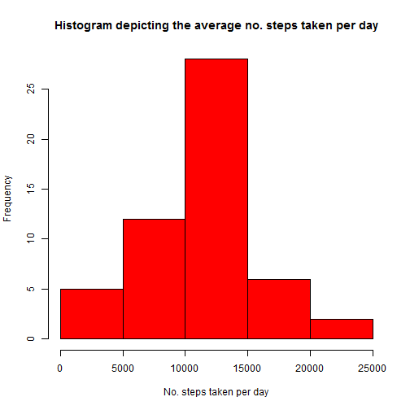
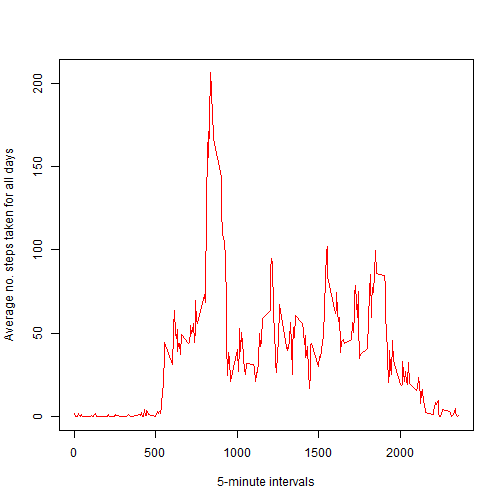
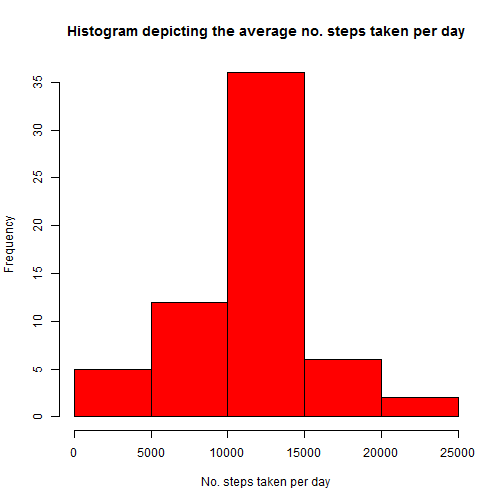

# Reproducible Research: Peer Assessment 1
===========================================
## Overview
This report describes the steps taken to demonstrate Reproducible Research for the Coursera Reproducible
Research Peer Assessment 1. It makes use of data from a personal activity monitoring device. The device collects data at 5 minute intervals through out the day. The data consists of two months of data from an anonymous individual collected during the months of October and November, 2012 and include the number of steps taken in 5 minute intervals each day. 

By analyzing this data, the report answers the questions as to the average number of steps taken each day, the daily activity patterns and highlights the differences between weekday and weekend activity patterns.

Additionally the report shows the steps taken and R Code used to provide the analysis results.

## Loading and preprocessing the data
1) Download and extract the [activity.zip](https://d396qusza40orc.cloudfront.net/repdata%2Fdata%2Factivity.zip) file into the **data** directory of the R working directory.

2) Read the data into R as a data frame.


```r
        ## Load the data
        df <- read.csv("./data/activity.csv", header = TRUE)
```

3) View the raw data.


```r
## Summarize the raw data
summary(df)
```

```
##      steps               date          interval   
##  Min.   :  0.0   2012-10-01:  288   Min.   :   0  
##  1st Qu.:  0.0   2012-10-02:  288   1st Qu.: 589  
##  Median :  0.0   2012-10-03:  288   Median :1178  
##  Mean   : 37.4   2012-10-04:  288   Mean   :1178  
##  3rd Qu.: 12.0   2012-10-05:  288   3rd Qu.:1766  
##  Max.   :806.0   2012-10-06:  288   Max.   :2355  
##  NA's   :2304    (Other)   :15840
```

```r
## View the data stucture
str(df)
```

```
## 'data.frame':	17568 obs. of  3 variables:
##  $ steps   : int  NA NA NA NA NA NA NA NA NA NA ...
##  $ date    : Factor w/ 61 levels "2012-10-01","2012-10-02",..: 1 1 1 1 1 1 1 1 1 1 ...
##  $ interval: int  0 5 10 15 20 25 30 35 40 45 ...
```

4) Transform the data for analysis.


```r
## Transform the column data is of a usable format, i.e steps column is numeric,
## date colum is date format and the interval colum is numeric.
df$steps <- as.numeric(df$steps)
df$date <- as.character(df$date)
df$interval <- as.numeric(df$interval)

## Convert the date colum to the appropriately formatted date
df$date <- as.Date(df$date, format = "%Y-%m-%d")
```


## What is mean total number of steps taken per day?
To analyse the number of steps taken per day, the data is broken down by day and totaled. The mean and median can then be calculated.


```r
## Summarize the number of steps by day
sumByDate <- tapply(df$steps, df$date, sum)

## Get the Mean of the number of steps per day
meanByDate <- mean(sumByDate, na.rm = TRUE)

## Get the Median of the numbner of steps per day
medianByDate <- median(sumByDate, na.rm = TRUE)
```

Below is the histogram depicting the mean total number of steps taken per day.


```r
## Plot the histogram showing the number steps taken per day.
hist(sumByDate, xlab = "No. steps taken per day", col = "red",
     main = "Histogram depicting the average no. steps taken per day")
```

 

The Mean is: **10766**  
The Median is: **10765**

## What is the average daily activity pattern?
To analyse the average daily activity pattern, the number of steps per daily interval are averaged. Below is a Time-Series plot depicting this pattern.


```r
## Summarize the number of steps per interval and the mean
meanByInterval <- tapply(df$steps, df$interval, mean, na.rm = TRUE)

## Plot the pattern of daily activity
plot(unique(df$interval), meanByInterval, type = "l", col = "red", 
     xlab = "5-minute intervals", ylab = "Average no. steps taken for all days")
```

 

```r
## Find the interval containing the maximum number of steps on average
interval <- df[which.max(meanByInterval), 3]
```

On average across all the days, the 5-minute interval that contains the maximum amount of steps, is the **835th** interval.

## Imputing missing values
From the initial summary taken it is evident that there are **2304** missing values (See item **3.** of the **Loading and processing the data** section). This can be verified from the following code chunk:


```r
## Confirm the total number of missing values (NA) in the data set
totalMissing <- sum(is.na(df))
```
Total number of missing values: **2304**

These missing values potentially introduce bias into the analysis performed in the previous sections.  By looking at the summary, the missing values are in the Steps column of the data frame.  To investigate whether the data is skewed by these missing values, a new data frame is created, substituting any missing values with the already calculated mean (`meanByInterval`) for the particular interval.


```r
## For loop for integrating the "meanByInterval" into new data frame
df2 <- df
for (i in 1:nrow(df)){
        if(is.na(df$steps[i])){
                df2$steps[i]<- meanByInterval[[as.character(df[i, "interval"])]]
        }
}
```

Using the new data frame, the analysis can be repeated (see the section on **total number of steps taken per day**) to see if the overall **mean** and **median** values differ.


```r
## Summarize the number of steps by day in the new data frame
newsumByDate <- tapply(df2$steps, df2$date, sum)

## Get the Mean of the number of steps per day in the new data frame
newmeanByDate <- mean(newsumByDate)

## Get the Median of the numbner of steps per day in the new data frame
newmedianByDate <- median(newsumByDate)
```
Below is the histogram depicting the mean total number of steps taken per day (**with the missing values replaced by the mean of the specific interval**).


```r
## Plot the histogram showing the number steps taken per day from the new data frame.
hist(newsumByDate, xlab = "No. steps taken per day", col = "red",
     main = "Histogram depicting the average no. steps taken per day")
```

 

The new Mean is: **10766**  
The new Median is: **10766**  

As can be seen, there is no difference to the **mean** or **median** by replacing the the missing values with the mean of the specific interval.

## Are there differences in activity patterns between weekdays and weekends?
To determine whether there are differences in the pattern of activity between weekend and weekdays, the data in the new data frame is categorized into a **weekday** or **weekend** day, based on the date.

From the new data, the time series plot below shows the average number of steps taken on the weekend, compared with the average number of steps taken on a weekday.

**Note:**The plot below is made using the lattice system lattice system. In order to reproduce the plot, ensure that the __lattice package__ is installed.


```r
## Add weekday colum to catagorize 
df2$weekday <- c("weekday")
df2[weekdays(as.Date(df2[, 2])) %in% c("Saturday", "Sunday"), ][4] <- 
        c("weekend")

## Add the factor levels
df2$weekday <- factor(df2$weekday)

## Get the average number of steps per interval for for weekend and weekday
meanByWeekday <- tapply(df2$steps[df2$weekday == "weekday"],
                        df2$interval[df2$weekday == "weekday"], mean)
meanByWeekend <- tapply(df2$steps[df2$weekday == "weekend"],
                        df2$interval[df2$weekday == "weekend"], mean)

## Create the plot
library(lattice)
xyplot(c(as.numeric(meanByWeekday), as.numeric(meanByWeekend)) 
       ~ rep(unique(df2$interval), 2) 
       | c(rep("weekday", length(meanByWeekday)),
           rep("weekend", length(meanByWeekend))),
       layout = c(1, 2), type = "l", xlab = "Interval",
       ylab = "Number of Steps")
```

 

As can be seen from the above plot, there is a higher number steps taken on average, over the weekends as opposed to during the week.
